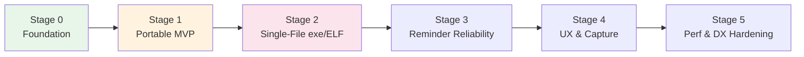

# 🗺️ Implementation Plan — Staged Delivery

**SmartNote Scheduler · Roadmap for the 50 enhancements + portable apps**

_Deviation-friendly: every stage ends with a working app and a go/no-go gate.
Nothing here is committed until you approve Stage 0._

---

## 📖 How to read this plan

- **Stages are vertical slices** — after each stage the app runs, tests pass, and you can ship or stop.
- Enhancement numbers (`#1–#50`) refer to [`ENHANCEMENTS.md`](./ENHANCEMENTS.md).
- Portable packaging details live in [`PORTABLE_APPS.md`](./PORTABLE_APPS.md).
- Durations assume **one developer**; parallelizable where noted.

---

## 🧱 Stage 0 — Foundation & Guardrails *(~3–4 days)*

> Make change cheap before making changes. Also unblocks honest estimates.

| Task | Enhancements | Deliverable |
|---|---|---|
| Add ESLint flat-config + Prettier sweep; wire `pnpm lint` | #49 | Clean baseline diff |
| Dual-driver test harness skeleton (Vitest runs storage against MySQL **and** SQLite) | #47 | CI matrix job |
| `pnpm db:seed` demo dataset (200 notes / 40 reminders) | #46 | Seed file |
| `/healthz`, graceful shutdown, `--version/--help` flags | #18 #20 | Patched `server/_core/index.ts` |
| Data-dir resolver module (`--data-dir`, OS defaults, `Data/` next-to-binary convention) | #14 | `server/_core/paths.ts` |
| Structured logging w/ correlation IDs | #39 | Middleware |

**✅ Gate:** CI green on both drivers; `smartnote --help` behaves. **GO/NO-GO decision point.**

---

## 📦 Stage 1 — Portable MVP ("zip that runs") *(~5–7 days)* ⭐ headline ask, fastest path

> Ship something you can copy to a Windows machine and double-click — no exotic toolchains yet.

| Task | Enhancements | Deliverable |
|---|---|---|
| Drizzle **SQLite adapter** (`bun:sqlite` or `better-sqlite3`) behind existing `getDb()` factory + sqlite migration set | #12 | Dual-DB storage layer |
| Local single-user auth fallback when `OAUTH_SERVER_URL` empty | — (RFC §Identity) | Offline login-free mode |
| In-process reminder scheduler replacing Heartbeat in portable mode | — (RFC §Scheduling) | `scheduler.ts` |
| Portable zip packaging scripts: bundled Node runtime + `dist/` + `Start.bat` / `start.sh` | #13 #15 #16 | `package:win`, `package:linux` |
| First-run `.env` bootstrap wizard (interactive) | #17 | readline setup flow |
| Backup/restore ZIP command (`--backup`, UI button) | #19 | `backups/*.zip` |
| Nightly snapshot rotation (last 7) | #43 | scheduler task |

**✅ Gate:** On a clean Win11 VM and an Ubuntu VM: unzip → run → create note → offline restart → data intact.
**Artifact:** `SmartNote-win-x64-portable.zip`, `SmartNote-linux-x64-portable.tar.gz`.

---

## 🚀 Stage 2 — Single-File Binaries *(~5–7 days)* ⭐ the true `.exe`

| Task | Enhancements | Deliverable |
|---|---|---|
| Prototype **Bun `--compile`** cross-builds (`bun-windows-x64`, `bun-linux-x64`) embedding client assets + migrations | #11 | `SmartNote.exe` (~90 MB), `smartnote` ELF |
| Fallback spike: Node 20 SEA + `postject` if Bun rejected | #11 | Alternative pipeline |
| AppImage recipe (Linux) | #16 | `SmartNote-x86_64.AppImage` |
| CI release workflow: build → sign (optional cert) → GitHub Release artifacts | #16 #44 | Tagged releases |
| Edge/Chrome `--app` shortcut generation so it "feels like a window" at zero cost | — | Shortcut files in zip |
| VirusTotal smoke-test process documented; code-signing decision executed | RFC §Risks | Release checklist |

**✅ Gate:** One file, no folder beside it, first-run creates `Data/`, all Stage-1 tests pass through the binary.

---

## 🔔 Stage 3 — Reminder Reliability *(~4–5 days)*

> The product's promise is "you won't forget". This stage hardens exactly that.

| Task | Enhancements | Deliverable |
|---|---|---|
| Idempotency key on `notification_logs (reminderId, dueAt)` | #31 | Migration + guard |
| Retry with exponential backoff (`attempts`, `nextRetryAt`) piggybacked on scheduler | #32 | Processor update |
| Recurring reminders (`recurrence` enum; reschedule-on-complete) | #26 | Schema + logic + UI toggle |
| Snooze presets endpoint + buttons | #36 | tRPC proc + chip row |
| Quiet hours + digest mode stored in preferences | #33 #34 | Filter/aggregation |
| Delivery history page over `notification_logs` | #35 | New route |
| "Next fire time" badge on reminder cards | #37 | Derived field |

**✅ Gate:** Kill/restart mid-send produces no duplicates; weekly recurring reminder fires twice in test; retry storm simulated → converges.

---

## 🎨 Stage 4 — UX & Capture Delight *(~5–6 days)*

| Task | Enhancements | Deliverable |
|---|---|---|
| Quick-capture mode in existing cmdk palette | #21 | `Ctrl+K → type → Enter` |
| Inline "due-date chips" from AI-parsed dates at save time | #22 | Suggestion row in editor |
| Pin/favorites section | #23 | Column + sort |
| Tags (join table, autocomplete, filter rail) | #24 | Schema + UI |
| Markdown-lite rendering (tiny renderer, sanitized) | #25 | View mode |
| Undo-toast archive/delete backed by soft-delete | #27 #42 | `deletedAt` + trash view + 30-day purge |
| Category tabs with counts (reuses stats query) | #28 | Tabs |
| Dark/light/system theme persisted to preferences | #29 | Toggle + CSS vars |
| Smart paste → note + auto-categorize | #30 | Drop handler |

**✅ Gate:** Capture-to-reminder flow ≤ 3 interactions; theme + tags survive portable restart.

---

## ⚡ Stage 5 — Performance & DX Hardening *(~4–5 days)*

| Task | Enhancements | Deliverable |
|---|---|---|
| Route-level code splitting + lazy pages | #1 | Smaller initial chunk |
| Unused Radix/component dep pruning (verified via import graph) | #2 | Slimmer lockfile/bundle |
| Search debounce + prefix index; date-fns consolidation | #3 #5 | Query tuning |
| List virtualization > 200 items; `content-visibility` skeletons | #4 #6 | Long-list perf |
| Self-hosted subset fonts + AVIF images + brotli precompress | #7 #8 #10 | Offline-safe assets |
| TanStack Query `staleTime` policy + persisted cache | #9 | Fewer refetches |
| Rate limiting (auth/AI) + Zod length hardening + cookie flags | #38 #40 #41 | Security patch set |
| Bundle-budget CI check + docs link validation | #48 #50 | Guardrails |

**✅ Gate (measurable):** Lighthouse mobile ≥ current baseline; main chunk −30 %; search p95 < 150 ms on 10 k-note seed; RSS of portable binary unchanged ±5 %.

---

## 📅 Summary Timeline (sequential, 1 dev)

| Stage | Duration | Cumulative | Ships |
|---|---|---|---|
| 0 · Foundation | 3–4 d | ~wk 1 | CI harness, healthz, data-dir |
| 1 · Portable MVP | 5–7 d | ~wk 2–3 | ✅ Portable zips (win/linux) |
| 2 · Single-file | 5–7 d | ~wk 4 | ✅ `SmartNote.exe` / ELF / AppImage |
| 3 · Reminders | 4–5 d | ~wk 5 | ✅ Recurring + reliable notifications |
| 4 · UX | 5–6 d | ~wk 6–7 | ✅ Tags, themes, quick capture |
| 5 · Perf/DX | 4–5 d | ~wk 8 | ✅ Optimized final build |

> **Reordering allowed.** If only portable apps matter short-term: run Stages 0→1→2, pause.
> If reliability matters more: swap Stage 3 before Stage 2 (they're independent).

---

## 🚦 Standing Rules For Every Stage

1. Every schema change = forward-only migration for **both** MySQL and SQLite sets.
2. No new runtime dependency without checking bundle-size delta (budget: +15 KB gz per feature max).
3. Tests added in the same PR as the feature; `pnpm test && pnpm check` must be green.
4. Docs updated in the same PR (`README`, `docs/API.md`, `docs/DATABASE.md`, `CHANGELOG.md`).
5. Each stage ends with a tagged pre-release build you can try before approving the next stage.

---

**⏸ Awaiting your decision: which stages to start with?**
Suggested minimum viable order: **Stage 0 → 1 → 2** (portable `.exe` + Linux first).

**© 2026 SmartNote Scheduler contributors · MIT License**

